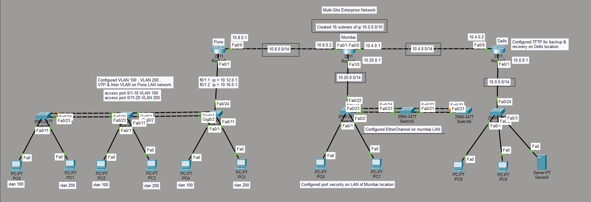
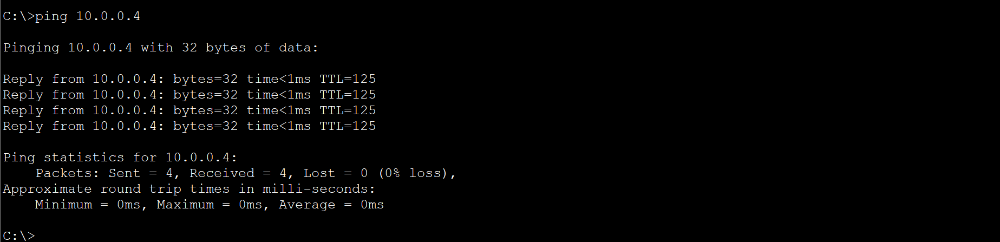

# cisco-multi-site-enterprise-network
Multi-site enterprise network built in Cisco Packet Tracer using VLANs, VTP, inter-VLAN routing, OSPF, DHCP, EtherChannel, port security, and STP security.

A multi-site enterprise network designed and configured using **Cisco Packet Tracer** as part of my CCNA learning journey.

The project connects three different locations — **Pune, Mumbai, and Delhi** — and demonstrates practical implementation of routing, switching, VLANs, network security, and end-to-end connectivity.

## 📸 Project Screenshots

### Network Topology



### End-to-End Connectivity



The network consists of three sites:

- 📍 Pune
- 📍 Mumbai
- 📍 Delhi

The sites are connected using routers and dynamic routing with OSPF.

## 🔧 Technologies & Concepts Implemented

### VLAN & Switching
- VLAN 100
- VLAN 200
- VTP
- Trunking
- Inter-VLAN Routing
- Router-on-a-Stick
- IEEE 802.1Q Encapsulation

### Routing
- OSPF Dynamic Routing
- Single-Area OSPF
- Router-to-Router Communication
- IP Addressing & Subnetting
- 16 Subnets created from `10.0.0.0/10`

### Network Services
- DHCP
- Automatic IP Address Assignment
- TFTP Backup & Recovery

### Network Security
- Switch Port Security
- PortFast
- BPDU Guard
- Router Username & Password Configuration

### Link Aggregation
- EtherChannel
- LACP

## 📍 Site Configuration

### Pune
- VLAN 100 & VLAN 200
- VTP
- Router-on-a-Stick
- Inter-VLAN Routing
- Trunking

### Mumbai
- LACP EtherChannel
- Port Security
- Trunking

### Delhi
- PortFast
- BPDU Guard
- TFTP Backup & Recovery
- Router Security Configuration

## 🌐 IP Addressing

The project uses the classless network:

`10.0.0.0/10`

The network was subnetted into **16 subnets** and used for communication between different network segments and locations.

## 🔄 Routing

**OSPF (Open Shortest Path First)** was configured to provide dynamic routing between the Pune, Mumbai, and Delhi sites.

A single OSPF area is used throughout the topology.

## 🧪 Connectivity Testing

End-to-end connectivity was tested using `ping`.

Example:

```text
ping 10.0.0.4

Packets: Sent = 4, Received = 4, Lost = 0 (0% loss)
